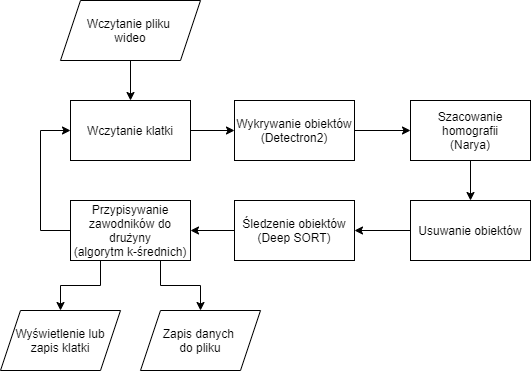

# FV2D
Narzędzie pozwalające na przetworzenie dowolnej transmisji wideo z meczu piłkarskiego do postaci, którą będzie mogła analizować kadra szkoleniowa.
## Przykład rezultatu
<p align="center">
     
</p>

## Przykładowe dane wyjściowe
### Format danych wyjściowych:
```
frame_id  object_class    score   bb_cx   bb_cy   bb_height   bb_width    trackId colorRED    colorGREEN  colorBlue   pitchx  pitchy
```
* Należy pamiętać, że położenie i rozmiary obwiedni (bounding box) _bb_cx, bb_cy, bb_height, bb_width_ są zależne od rozmiaru przetwarzanego wideo i nie są w żaden sposób normalizowane.   
* Natomiast położenie zawodnika lub piłki (pitchx, pitchy) na planszy 2D są normalizowane do przedziału [0, 1]. W celu wyśwetlenia ich pozycji na planszy koordynaty te należy pomnożyć przez rozmiary planszy odpowiednio pitchx\*szerokość_planszy i pitchy\*wysokość_planszy.
* score - Wynik dokładoności oszacowania, że dany obiekt należy to danej klasy (człowiek, piłka), czyli jakie jest prawdopodobieństwo, że jest to człowiek lub piłka.
### Przykładowy plik wynikowy csv:
```
1;0;1.0;345;357;26;81;;42;131;125;0.8745990566794001;0.42697702753104183
1;0;0.99;709;390;32;86;;235;233;223;0.9248030235355467;0.5265407318748327
1;0;0.99;650;395;32;71;;42;131;125;0.919066951052594;0.5071545605171993
1;0;0.98;782;433;36;83;;235;233;223;0.9210400921319793;0.5815903186808422
1;0;0.98;879;323;37;70;;137;103;107;0.9872633366789513;0.44516956744259006
1;0;0.97;628;380;30;78;;235;233;223;0.9184624777711852;0.49418660982238183
...
```
### Przykład wizualizacji danych w narzędziu do wizualizacji
<p align="center">
     
</p>

## Rezultaty:
### Rozpoznawanie zawodników i piłki:
| Model                        | Dataset                                            | zawodnicy AP | piłka AP     | object detection threshold | mAP |
|------------------------------|----------------------------------------------------|--------------|--------------|----------------------------|-----|
| mask_rcnn_X_101_32x8d_FPN_3x | Lech_Poznan_Miedz_legnica_ part1_s1 (1500 klatek)  | 0.72 (72%)   | 0.04 (4%)    | 0.3                        | 38% |
| panoptic_fpn_R_101_3x        | Lech_Poznan_Miedz_legnica_ part1_s1 (1500 klatek)  | 0.65 (65%)   | 0.006 (0.6%) | 0.3                        | 33% |
| faster_rcnn_R_50_FPN_3x      | Lech_Poznan_Miedz_legnica_ part1_s1 (1500 klatek)  | 0.61 (61%)   | 0.008 (0.8%) | 0.3                        | 31% |
| YoloV5x6                     | Lech_Poznan_Miedz_legnica_ part1_s1 (1500 klatek)  | 0.74 (74%)   | 0.006 (0.6%) | 0.3                        | 37% |
| mask_rcnn_X_101_32x8d_FPN_3x | Lech_Poznan_Miedz_legnica_ part2_s1 (1499 klatek)  | 0.68 (68%)   | 0.09 (95)    | 0.3                        | 39% |
| panoptic_fpn_R_101_3x        | Lech_Poznan_Miedz_legnica_ part2_s1 (1499 klatek)  | 0.66 (66%)   | 0.03 (3%)    | 0.3                        | 35% |
| faster_rcnn_R_50_FPN_3x      | Lech_Poznan_Miedz_legnica_ part2_s1 (1499 klatek)  | 0.53 (53%)   | 0.06 (6%)    | 0.3                        | 30% |
| YoloV5x6                     | Lech_Poznan_Miedz_legnica_ part2_s1 (1499 klatek)  | 0.70 (70%)   | 0.02 (2%)    | 0.3                        | 36% |
| mask_rcnn_X_101_32x8d_FPN_3x | SoccerDB (250 klatek)*                             | 0.92 (92%)   | 0.15 (15%)   | 0.3                        | 54% |
| panoptic_fpn_R_101_3x        | SoccerDB (250 klatek)*                             | 0.93 (93%)   | 0.23 (23%)   | 0.3                        | 58% |
| faster_rcnn_R_50_FPN_3x      | SoccerDB (250 klatek)*                             | 0.94 (94%)   | 0.19 (19%)   | 0.3                        | 27% |

### Wyniki uzyskane przez SoccerDB:
<p align="center">
     
</p>

### Wyniki szacowania homografii:
| Walidacja na zbiorze danych WorldCup2014 | IOU (Indeks Jaccarda) |
|------------------------------------------|-----------------------|
| CNN based on EfficientNetB2              | 0,83                  |
| CNN based on ResNet                      | 0,86                  |

### Czas działania systemu:
| Długość wideo | Liczba klatek na sekundę | Czas działania systemu | Tracking | Detekcja drużyn |
| --- |--------------------------|------------------------|----------|-----------------|
|  15s   | 30                       | 702s                   | Tak      | Tak             |
|  15s   | 30                       | 668s                   | Nie      | Tak             |
|  15s   | 30                       | 436s                   | Nie      | Nie             |
## Architektura systemu
<p align="center">
     
</p>

## Zastosowane platformy
### Rozpoznawanie obiektów (zawodników i piłki):
* Detectron2 - https://github.com/facebookresearch/detectron2

### Śledzenie obiektów (zawodników i piłki):
* Deep SORT - https://github.com/ZQPei/deep_sort_pytorch

### Homografia:
* Narya - https://github.com/DonsetPG/narya

### Przypisywanie zawodnikóœ do drużyny
* Algorytm K-Średnich

## Modele pretrenowane:
### Rozpoznawanie obiektów (zawodników i piłki):
* Detectron2 - https://github.com/facebookresearch/detectron2/blob/main/MODEL_ZOO.md   

W przypadku podania ścieżki do konfiguracji modelu, model zostanie pobrany automatycznie np:
```
object_detection_model_path = "COCO-InstanceSegmentation/mask_rcnn_X_101_32x8d_FPN_3x.yaml"
```
### Śledzenie obiektów (zawodników i piłki):
* Deep SORT PyTorch - https://drive.google.com/drive/folders/1xhG0kRH1EX5B9_Iz8gQJb7UNnn_riXi6
* FastReId (użyty Market1501 BoT(R101-ibn)) - https://github.com/JDAI-CV/fast-reid/blob/master/MODEL_ZOO.md
### Homografia:
* Narya - https://github.com/DonsetPG/narya#links-to-the-models-and-datasets-from-the-original-paper
## Instalacja środowiska
Narzędzie wymaga systemu operacyjnego linux oraz zainstalowanego oprogramowania miniconda.   
Testowane wersje:   
**Python=3.7.12 (przetestowane)**  
**pytorch=1.10.1+cu111 (przetestowane)**  
**cudatoolkit=11.1.1 (przetestowane)**  
**cudnn=8.2.1.32 (przetestowane)**  
**gcc and g++=9.4.0 (przetestowane)**  
**tensorflow=2.8.0 (przetestowane)**   
**scikit-learn=0.23.2 (przetestowane)**   
**conda=4.12.0 (przetestowane)**   
**qt=5.12.9 (przetestowane)**   
**pyside2=5.13.2 (przetestowane)**   
### Pobieranie repozytorium
~~Aby prawidłowo pobrać modele z repozytorium należy oprócz git'a mieć zainstalowany **git-lfs**.~~   
Lub pobrać modele z https://drive.google.com/drive/folders/1yJgAJzOrdx38-elP1s7tXdHzex5UFR7t?usp=sharing lub liknów podanych w [Modele pretrenowane](#modele-pretrenowane)
```
git clone https://github.com/JN426206/WebFV2D/
cd WebFV2D
```
### Tworzenie środowiska FV2D
```bash
conda create --name FV2D python==3.7
conda activate FV2D
conda install pip -y
conda install -c pytorch -c conda-forge cudatoolkit=11.1 cudnn tqdm scikit-learn easydict faiss -y
pip install torch==1.10.1+cu111 torchvision==0.11.2+cu111 torchaudio==0.10.1 -f https://download.pytorch.org/whl/torch_stable.html
pip install opencv-python
conda install gcc_linux-64 gxx_linux-64 -y
ln -s ~/miniconda3/envs/FV2D/bin/x86_64-conda-linux-gnu-gcc ~/miniconda3/envs/FV2D/bin/gcc
ln -s ~/miniconda3/envs/FV2D/bin/x86_64-conda-linux-gnu-g++ ~/miniconda3/envs/FV2D/bin/g++
cp ~/miniconda3/envs/FV2D/lib/python3.7/_sysconfigdata_x86_64_conda_cos6_linux_gnu.py ~/miniconda3/envs/FV2D/lib/python3.7/_sysconfigdata_x86_64_conda_linux_gnu.py
python -m pip install detectron2==0.6 -f https://dl.fbaipublicfiles.com/detectron2/wheels/cu111/torch1.10/index.html
pip install tensorflow==2.8.0 segmentation-models gluoncv Shapely moviepy kornia django
conda env config vars set LD_LIBRARY_PATH=~/miniconda3/envs/FV2D/lib
conda deactivate
conda activate FV2D
```
### Dla trenowania homografii (doinstalować do środowiska FV2D):
```bash
pip install lxml
pip install -U albumentations[imgaug]
```
### Narzędzie do wizualizacji w środowisku FV2D(vizualize_tool/visualize/):
```bash
conda install -c anaconda pyqt 
conda install -c conda-forge pyside2 
conda install -c conda-forge pyinstaller 
```
### Narzędzie do wizualizacji osobne środowisko (vizualize_tool/visualize/):
```bash
conda create --name FV2D_VT python==3.7
conda activate FV2D_VT
conda install -c anaconda pyqt 
conda install -c conda-forge pyside2 
conda install -c conda-forge pyinstaller 
pip install opencv-python
```
### Rozwiązywanie problemów podczas instalacji lub uruchamiania:
[troubleshooting.md](troubleshooting.md)

## Dataset

### Przykładowy materiał wideo
[lplw2.mp4](https://drive.google.com/file/d/11OT4gD1zT3JQX9YApjQQiGfkR1kCr4KZ/view?usp=sharing)   
Utworzyć w repozytorium katalog data następnie skopiować pobrany plik do tego katalogu. 

### Porównanie zbiorów danych:

| Zbiór                                            | Rozdzielczość  | Oznaczone klatki             | Homografia   | Uwagi                                                                                                                 |
|--------------------------------------------------|----------------|------------------------------|--------------|-----------------------------------------------------------------------------------------------------------------------|
| [SoccerDB](https://github.com/newsdata/SoccerDB) | FullHD 25kl/s  | co 3 klatki (45 000 klatek¹) | Brak         | Pozycja klatki zapisana jest za pomocą czasu i numeru klatki więc jest to zapis nie dokładny.²                        |
| [SoccerNET](https://www.soccer-net.org/)         | FullHD 25kl/s  | co 12 klatek (5400 klatek³)  | co 12 klatek | Pozycja klatki oraz homografii zapisana jako klatka po klatce dla nagrania 2kl/s. Homografia nie jest super dokładna. |
| Wyscout                                          | FullHD 25kl/s  | Brak                         | Brak         |                                                                                                                       |

1 - 90*60*(25//3)/2 = 45000   
2 - Klatki zapisane są w bazie lmdb. Pozycja klatki w danym segmencie (akcji/event'cie) zapisana jest jako numer klatki w tej akcji. Pozycja eventu zapisana jest w pliku seg_info.csv i pozycja opisana jest za pomocą czasu a nie za pomocą numeru klatki w oryginalnym nagraniu wideo. Aby obliczyć numer badanej klatki względem oryginalnego wideo należy obliczyć numer klatki dla start_time następnie dodać do tej klatki offset badanej klatki z bazy lmdb. Obliczanie numeru klatki z czasu jest niedokładne i może wprowadzać błąd pozycjonowania badanej klatki. Implementacja narzędzia do wczytywania danych z bazy lmdb: [lmdb_read.py](tools/lmdb_read.py).    
3 - Adnotacje w SoccerNET oznaczane są na nagraniach przekonwertowanych do 2 klatek/s. 90*60*(25//12)/2 = 5400 klatek. Adotacje homografii nie są idealne i czasami są rozbieżne z prawdziwymi liniami na boisku. Narzędzie do wczytywania danych z SoccerNET: [soccer_net.py](tools/soccer_net.py).   
Dane z dnia 16.12.2021r.
## Uruchamianie
```bash
conda activate FV2D
python FV2D.py --video-input data/lplw2.mp4
# Eksport danych do pliku
python FV2D.py --video-input data/lplw2.mp4 --export-data-path data/lplw2.csv
#Zapisanie wizualizacji do pliku wideo
python FV2D.py --video-input data/lplw2.mp4 --output data/pred_lplw2.mp4
```
## Uruchamiania narzędzia do wizualizacji:
```
conda activate FV2D_VT
cd vizualize_tool/visualize/
python widget.py
``` 
Budowanie narzędzia do wizualizacji zostało opisane w [troubleshooting.md](troubleshooting.md).

## Narzędzia do ewaluacji modeli
### Rozpoznawanie zawodników i piłki:
https://github.com/rafaelpadilla/review_object_detection_metrics   
**Przydatny skrypt:** tools/pred_to_files.py
<p align="center">
     
</p>

## Narzędzie do ewaluacji i trenowania modeli detekcji obiektów
https://github.com/JN426206/ODATT

### Śledzenie oraz przypisywanie zawodników do drużyny:
[Official MOTChallenge Evaluation Kit](https://github.com/dendorferpatrick/MOTChallengeEvalKit)

## Narzędzia do oznaczania danych

### Rozpoznawania, śledzenie piłki oraz zawodników i przypisywanie zawodników do drużyny:
[DarkLabel](https://github.com/darkpgmr/DarkLabel)

### Szacowanie homografii:
https://github.com/larsmaurath/narya-label-creator  
https://github.com/kkoripl/NaryaKeyPointsDatasetCreator

### Generowanie danych za pomocą symulatora _Google Research Football_
https://github.com/google-research/football

## Co można poprawić/dodać/zmienić:

* Detekcja zawodników i piłki:
  * Przyciąć obraz wideo do obszaru boiska (wyciąć trybuny itp.)
  * Podzielić obraz na cztery równe regiony gdzie każdy z nich będzie przetwarzany osobno
  * Dotrenować pretrenowane modele na zbiorze dotyczącym już tylko piłki nożnej a konkretniej zawodników i piłki
  * Poprawić jakość materiału wideo za pomocą preprocessingu
    * Video Super Resolution
    * [BM3D](https://github.com/glemaitre/BM3D)
  * Do piłki zastosować model wykrywający małe obiekty
  * Badanie obiektów szybko przemieszczających się
  * Zmienić konfigurację parametrów (threshold itp.)
* Homografia
  * Dodać filtr Kalmana
  * Zbadać filtr Savitzky-Golay (Savgol filter) (https://pubs.acs.org/doi/10.1021/acsmeasuresciau.1c00054)
  * Dotrenować pretrenowane sieci, szczególnie dla ujęć środkowego pola boiska
  * Zmienić konfigurację parametrów (threshold itp.)
* Śledzenie zawodników i piłki
  * Dotrenować pretrenowane sieci
  * Zmienić konfigurację parametrów (threshold itp.)
  * Zbadać wektory ruchu dostępne w kodowaniu H.264 (https://github.com/LukasBommes/mv-extractor)
  * Przetestować inne platformy
  * Zintegrować z algorytmem do przypisywania zawodników do dróżyny np. zawodnik z kolorem niebieskim nie może trzymać identyfikatora zawodnika z kolorem czerwonym.
* Przypisywanie zawodnikóœ do drużyny
  * Ulepszyć aktualny algorytm bazujący na K-Średnich zmieniając sposób porównywania kolorów klasyfikując do mniejszej palety barw.
    * Zbadać wykorzystanie odległości euklidesowych
  * Zbadać algorytm Gaussian mixture models (GMM)
  * Zastosować sieć CNN (rozpoznawania kolorów, wzorów na koszulce)
  * Rozpoznawać cechy zawodnikóœ np. numer koszulki, kolor butów, styl poruszania, fryzura
  * Zniwelować wpływ oświetlenia na kolor
* Inne
  * Dodać diagram Woronoja
    * http://durtal.github.io/interactives/Football-Voronoi/
    * https://medium.com/football-crunching/using-voronoi-diagrams-in-football-ca730ea81c05
  * Ulepszyć narzędzie wizualizacji
    * Mapa pressingu
    * Wyświetalnie statystyk
      * Ilość przebiegniętych kilometrów przez danego zawodnika
      * Kierunek przemieszczania zawonika i piłki
      * Najczęstrze miejsca oddawania strzałów
  * Przyśpieszyć działanie narzędzia
    * Implementacja OpenCV na GPU
    * Optymalizacja algorytmów szczególnie przypisywanie zawodników do drużyny

## Alternatywne platformy

* Detekcja zawodników i piłki
  * Yolo
  * MMdetection
* Homografia
  * https://github.com/vcg-uvic/sportsfield_release

## Licencja

Narzędzie FV2D wydane zostało na licencji [Apache 2.0](LICENSE).

## Autor narzędzia
mgr inż. Jan Nowak   
email: 95jan.nowak@gmail.com   
Uniwersytet im. Adama Mickiewicza w Poznaniu   
Wydział Matematyki i Informatyki   
Promotor: prof. UAM dr hab. Krzysztof Dyczkowski   
Narzędzie powstało przy współpracy z klubem sportowym KKS Lech Poznań   
Narzędzie do rozpoznawania pola boiska wdrożone zostało przy współpracy z Zofią Galla (gallazofia@gmail.com)
<p align="center">
    
</p>

Narzedzie stworzone i wykorzystywane na potrzeby przedmiotu "Projekt badawczo-rozwojowy"
